# Plan Pulse Compass - Architecture Analysis & Core Flows

## Executive Summary

Plan Pulse Compass is a comprehensive team planning and resource management application designed for organizations managing complex project portfolios, team allocations, and financial tracking. The application provides a unified platform for strategic planning, execution tracking, and financial analysis across multiple teams, projects, and time horizons.

## System Architecture Overview

```mermaid
graph TB
    subgraph "Frontend Layer"
        A[React App] --> B[App Context]
        B --> C[Theme Context]
        A --> D[Pages]
        A --> E[Components]
        A --> F[UI Components]
    end

    subgraph "Business Logic Layer"
        G[Financial Calculations] --> H[Planning Engine]
        H --> I[Tracking System]
        I --> J[Scenario Analysis]
        J --> K[Budget Optimization]
    end

    subgraph "Data Layer"
        L[Encrypted Storage] --> M[Local Storage]
        M --> N[Data Loader]
        N --> O[CSV Import/Export]
    end

    subgraph "Visualization Layer"
        P[Canvas Views] --> Q[React Flow]
        Q --> R[Charts & Reports]
    end

    B --> G
    D --> H
    E --> I
    F --> P
    G --> L
    H --> M
    I --> N
    P --> O
```

## Core Data Model & Relationships

## Core Business Flows

### 1. Financial Calculation Flow

### 2. Planning & Allocation Flow

### 3. Progress Tracking & Variance Analysis Flow

### 4. Data Import/Export Flow

### 5. Canvas Visualization Flow

## Component Architecture

### Main Application Structure

### Data Flow Architecture

## Key Business Rules & Calculations

### 1. Financial Calculation Rules

### 2. Planning Validation Rules

### 3. Progress Tracking Rules

## Security & Data Privacy

## Performance Optimization

## Integration Points

## Deployment Architecture

## Conclusion

Plan Pulse Compass represents a sophisticated resource planning and management system with:

1. **Comprehensive Data Model**: Hierarchical organization structure with complex relationships
2. **Advanced Financial Engine**: Multi-tier cost calculation with support for different employment types
3. **Flexible Planning System**: Scenario-based planning with feasibility analysis
4. **Real-time Tracking**: Variance analysis and progress monitoring
5. **Rich Visualizations**: Interactive canvas views for complex data relationships
6. **Data Privacy**: Local-first architecture with encrypted sensitive data
7. **Performance Optimized**: React-based with efficient data structures and caching

The system is designed to scale from small teams to large enterprises while maintaining data privacy and providing powerful planning and tracking capabilities.
